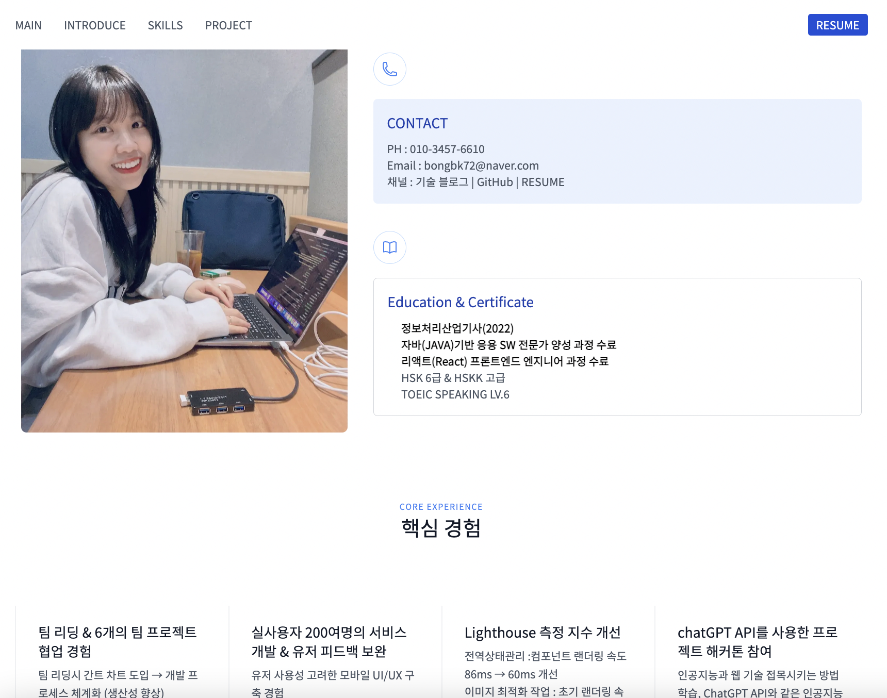
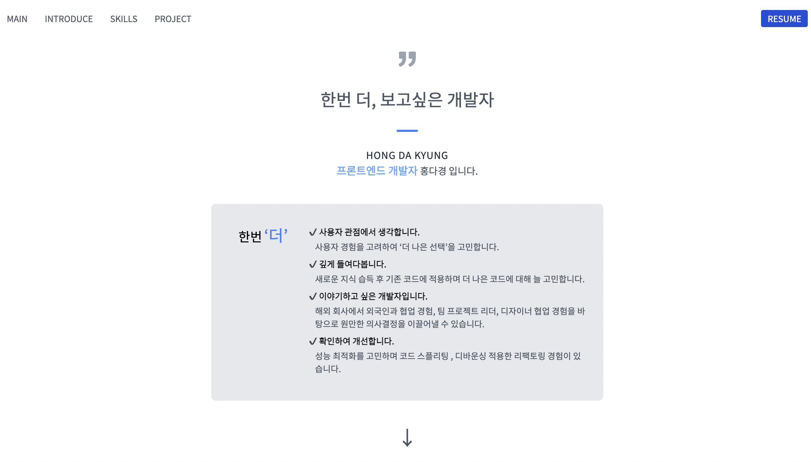

# HDK PORTFOLIO PROJECT !

## 👩🏻‍💻 프로젝트 소개

- 홍다경 포트폴리오
- 1인 프로젝트
- 모바일 반응형 웹 프로젝트입니다.

## 👀 PREVIEW (데스크탑)

 >

## 👀 PREVIEW (모바일)

  

 

 

## 🖇 LINK

[포트폴리오 바로가기](https://hongdakyung.vercel.app/)

## 🛠 SKILLS

ㄴ Next.js, TypeScript, notion-client, Tailwind, AOS, Vercel

## 👩🏻‍💻 작업 기간

ㄴ 2023.04.23 - 2022.04.26

## 🛠 기술 선정

> Next.js

- SSR과 SSG를 지원하므로 검색 엔진 최적화(SEO)에 용이합니다.
- 페이지 전환 시 로딩 속도가 빠르고, 초기 로딩 속도를 개선해줍니다.
- 코드 스플리팅, 프리페칭 등의 기능으로 성능 최적화를 할 수 있습니다.

> TypeScript

- 정적 타입 언어로서, 개발자의 실수를 사전에 방지해줍니다.
- 코드 가독성이 높아져 유지보수가 용이합니다.
- 타입 추론 기능을 통해 개발 생산성을 높일 수 있습니다.

> Notion-Client

- 노션 데이터베이스는 사용하기 쉽고 직관적인 UI를 제공합니다. 이를 통해 데이터를 더욱 쉽게 업데이트할 수 있습니다.

- 노션 API를 이용하면 노션 데이터베이스의 내용을 다양한 방식으로 수정할 수 있습니다. 여러 개의 페이지를 일괄적으로 수정하거나, 특정 페이지에 대한 수정을 자동화할 수 있습니다.

> Vercel

- Next.js를 만든 회사이며, Next.js와의 호환성이 뛰어납니다.
- 무료 배포를 지원하며, CI/CD 자동화 기능이 있어 개발 생산성을 높일 수 있습니다.
- 글로벌 CDN을 제공하므로 전 세계적으로 빠른 로딩 속도를 제공합니다.

> Tailwind CSS

- 클래스 기반 CSS 프레임워크로서, 디자인 구현이 빠르고 쉽습니다.
- 반응형 디자인을 간편하게 구현할 수 있으며, 유지보수가 용이합니다.
- 브라우저 호환성이 좋아 높은 접근성을 제공합니다.

> AOS 라이브러리

- 스크롤 애니메이션 라이브러리로서, 사용자에게 시각적인 효과를 제공합니다.
- CSS 애니메이션과 다르게 자바스크립트로 구현되어, 브라우저 호환성이 우수합니다.
- 다양한 애니메이션 효과를 제공하므로, 디자인 구현에 유용합니다.

## ✨ 주요 구현 사항

- 이미지 최적화 작업
- 모바일 반응형 UI/UX
- AOS 라이브러리 사용 -> 애니메이션 적용
- 노션 API 사용 -> 노션 db 연동
- TypeScript 적용 -> 타입 안정화
- meta 태그 설정, SSR 채택 -> SEO 고려
